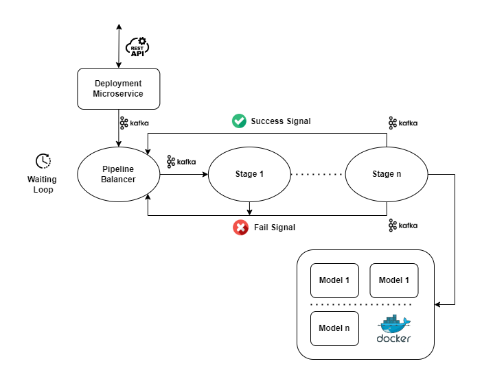
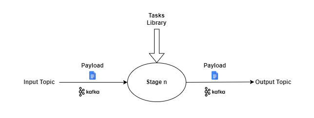
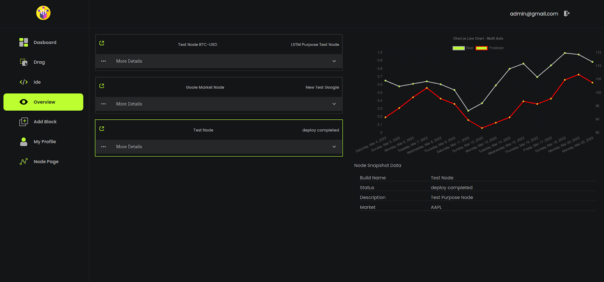

# Machine Learning Bots Ecosystem
###### _for Stock Market Prediction_
### Build, Deploy, Supervise

Web Platform to automate creation and deployment flow of TensorFlow models in docker nodes.

- Layers microservice architecture (presentation | business | persistence)
- API gateway (heart beat mecanism) 
- Deployment pipe for nodes in Docker (Kafka based)
- Live node status and preice predictions

## Dev Stack

| Presentation Layer | Business Layer | Persistence Layer | Deployment Pipe
| ------ | ------ | ------ | ------ |
| React | Node | Node |Docker |
| MUI | Expressjs | Expressjs | ApacheKafka |
| --- | --- | mongoose |--- |
| --- | --- | mongoDb |--- |

